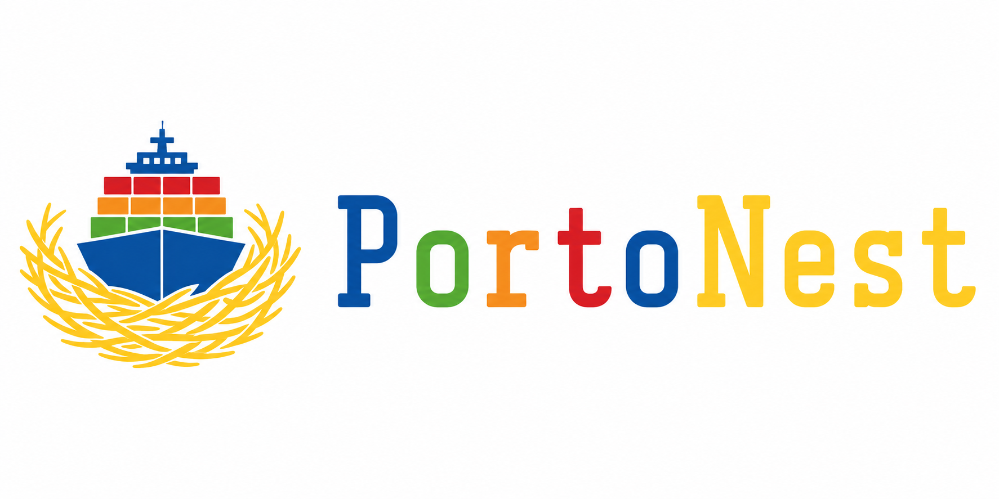

<p align="center">
  
</p>

<p align="center"><b>
  We brought Porto to the Nest level!
</b></p>

<p align="center">
  A NestJS framework implementing the Porto SAP (Software Architectural Pattern) architecture.
</p>

---

## What is PortoNest?

PortoNest is a framework built on top of NestJS that implements the **Porto SAP** architecture — a modern software architectural pattern grounded in DDD, Modular, Micro Kernel, MVC, Layered, and ADR architectures. It enables building scalable backend applications that start as a clean monolith and can expand to microservices when needed.

## Purpose

Provide a structured, opinionated NestJS project template with:

- A two-layer architecture: **Containers** (business logic) and **Ship** (infrastructure)
- Automatic file discovery and component registration via webpack plugin
- A custom path alias system enforcing dependency rules at the import level
- Clear separation of concerns with single-responsibility components

## Project Deliverables

| Artifact | Description |
|----------|-------------|
| **Framework Template** | A scaffoldable NestJS project with Porto SAP structure (`npx porto-nest init`) |
| **npm Package** | CLI tool + dev tooling (webpack plugins, import linting, file discovery) |
| **Kiro Power** | Architecture-aware steering, hooks, and enforcement for Kiro sessions |
| **VS Code Extension** | Linting, IntelliSense, and path alias resolution for PortoNest projects |

## Architecture Overview

Porto SAP organizes code into two layers:

- **Containers Layer** — Holds all business logic in modular units (Containers), grouped into Sections (bounded contexts). Each Container encapsulates a domain with Actions, Tasks, Models, Controllers, Routes, and more.
- **Ship Layer** — Shared infrastructure: base classes, interfaces, integration adapters, and core services. Decouples application code from the framework.

Data flows through: `Route → Controller → Action → Tasks → Response`

## Current State

🚧 **Early development** — Requirements and architectural steering are defined. Implementation of the monorepo structure, template, package, and tooling is in progress.

## Monorepo Structure (Planned)

```
/power      — Kiro Power source files
/plugin     — VS Code extension source
/package    — npm package (CLI + webpack plugins + dev tooling)
/template   — PortoNest project template (scaffolded via CLI)
/sample     — Integration test project using local references
```

## License

TBD
